<!-- Compact GitHub Stats in One Row -->

  

<!-- <pre>
┌──────────────────────────────────────────────────────────────────────────────────────────────────────────────┐
│ ◉  ◎  ◎    ┌─── NVIM ───┐   tabs: [1] README.md  [2] stats.md                      djraivis — /dev/crafts   │
├────────────────────────────────────────────┬────────────────────────────────────────┬─────────┤
│ whoami → Minimalist • Terminal-driven      │ Less chrome, more signal.             │ /\_/\    │
│ stack  → Go · Inkdrop · Terminal UIs       │ Text-first. Keyboard-friendly.        │( o.o )   │
│ focus  → Developer tooling • Minimal UIs   │ sidekick spotted →                     │ > ^ <    │
├────────────────────────────────────────────┴────────────────────────────────────────┴  🐾   ──┤
│ now → UKTV CTV • Go practice • Ghostty setup                                                                     │
├────────────────────────────────────────────────────────────────────────────────────────────────────────────────────┤
│ NORMAL  README.md  utf-8  unix  main  LSP:✓  diag:0E 0W  %:100  Ln 42, Col 1                               mmm  │
└──────────────────────────────────────────────────────────────────────────────────────────────────────────────────┘
</pre> -->

  
What I’m listening to while coding

  
  
  

