  

<!-- Terminal-styled sections: buttons in one row, content spans full width -->

  <!-- Button row -->
  <table style="width: 100%; table-layout: fixed; border-spacing: 8px;">
    <tr>
      <td style="width: 33.33%; white-space: nowrap;">
        <button onclick="toggleSection('music')" id="music-btn" style="cursor: pointer; padding: 8px 16px; border: 1px solid #30363d; border-radius: 6px; background: #0d1117; color: #f0f6fc; width: 100%;">🎵 some music</button>
      </td>
      <td style="width: 33.33%; white-space: nowrap;">
        <button onclick="toggleSection('stats')" id="stats-btn" style="cursor: pointer; padding: 8px 16px; border: 1px solid #30363d; border-radius: 6px; background: #0d1117; color: #f0f6fc; width: 100%;">📊 stats/contributions</button>
      </td>
      <td style="width: 33.33%; white-space: nowrap;">
        <button onclick="toggleSection('home')" id="home-btn" style="cursor: pointer; padding: 8px 16px; border: 1px solid #30363d; border-radius: 6px; background: #0d1117; color: #f0f6fc; width: 100%;">🏠 working from home</button>
      </td>
    </tr>
  </table>

<!-- Full-width content sections -->

  
  
  
  

  
    
  
  

  <video width="100%" autoplay loop muted playsinline>
    <source src="assets/masthead.mp4" type="video/mp4">
    <source src="assets/masthead.m4v" type="video/mp4">
    Your browser does not support the video tag.
  </video>

